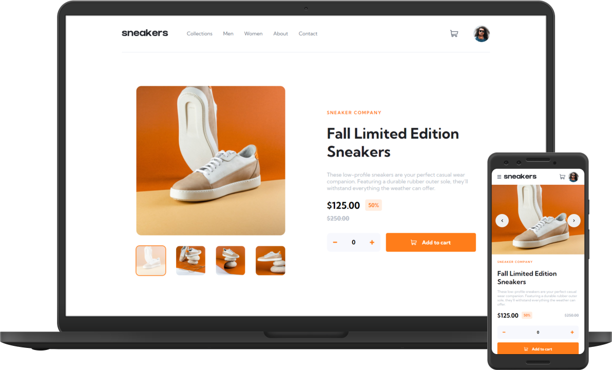

# Frontend Mentor - E-commerce product page solution

This is a solution to the [E-commerce product page challenge on Frontend Mentor](https://www.frontendmentor.io/challenges/ecommerce-product-page-UPsZ9MJp6). Frontend Mentor challenges help you improve your coding skills by building realistic projects.

## Overview

### The challenge

Users should be able to:

- View the optimal layout for the site depending on their device's screen size
- See hover states for all interactive elements on the page
- Open a lightbox gallery by clicking on the large product image
- Switch the large product image by clicking on the small thumbnail images
- Add items to the cart
- View the cart and remove items from it

### Screenshot

### Links

- Solution URL: [https://www.frontendmentor.io/solutions/ecommerce-product-page-using-react-and-sass-\_t5T8Ohee3](https://www.frontendmentor.io/solutions/ecommerce-product-page-using-react-and-sass-_t5T8Ohee3)
- Live Site URL: [ecommerce-product-page-frontendmentor.netlify.app](https://ecommerce-product-page-frontendmentor.netlify.app/)

### Built with

- [React](https://reactjs.org/) - JS library
- [Sass](https://sass-lang.com/) - Sass

## Author

- Website - [kamilbieniek.pl](https://www.kamilbieniek.pl/)
- Frontend Mentor - [@MrZuXii](https://www.frontendmentor.io/profile/MrZuXii)
- Twitter - [@MrZuxii](https://twitter.com/MrZuxii)
